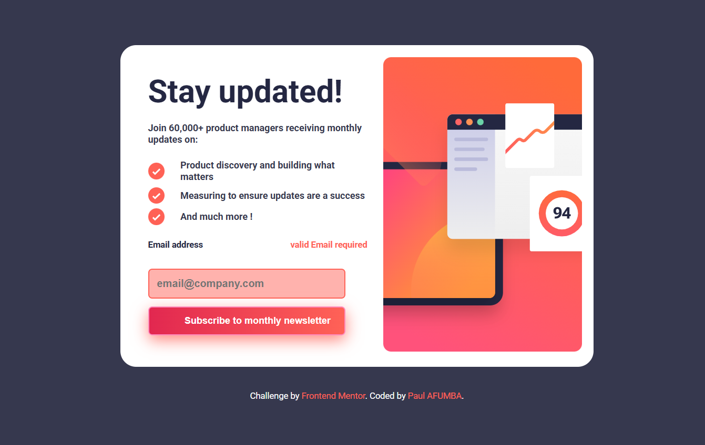

# Frontend Mentor - Newsletter sign-up form with success message solution

This is a solution to the [Newsletter sign-up form with success message challenge on Frontend Mentor](https://www.frontendmentor.io/challenges/newsletter-signup-form-with-success-message-3FC1AZbNrv). Frontend Mentor challenges help you improve your coding skills by building realistic projects.

## Table of contents

- [Overview](#overview)
  - [The challenge](#the-challenge)
  - [Screenshot](#screenshot)
  - [Links](#links)
- [My process](#my-process)
  - [Built with](#built-with)
  - [What I learned](#what-i-learned)
  - [Continued development](#continued-development)
  - [Useful resources](#useful-resources)
  - [AI Collaboration](#ai-collaboration)
- [Author](#author)
- [Acknowledgments](#acknowledgments)

## Overview

### The challenge

Users should be able to:

- Add their email and submit the form
- See a success message with their email after successfully submitting the form
- See form validation messages if:
  - The field is left empty
  - The email address is not formatted correctly
- View the optimal layout for the interface depending on their device's screen size
- See hover and focus states for all interactive elements on the page

### Screenshot



### Links

- Solution URL: [GitHub Repository](https://github.com/FreeDev-Group/newsletter-sign-up-with-success-Paul)
- Live Site URL: [Live Demo](https://freedev-group.github.io/newsletter-sign-up-with-success-Paul/)

## My process

### Built with

- Semantic HTML5 markup
- CSS custom properties (CSS variables)
- Flexbox
- CSS Grid
- Mobile-first responsive design
- Vanilla JavaScript (ES6+)
- Form validation with regex

### What I learned

This project was a great opportunity to practice form handling and validation in vanilla JavaScript. Here are some key learnings:

**Form Validation:**

```js
// Email validation using regex
function isValidEmail(email) {
  const emailRegex = /^[^\s@]+@[^\s@]+\.[^\s@]+$/;
  return emailRegex.test(email);
}
```

**DOM Manipulation:**

```js
// Toggling visibility of elements
card.style.display = "none";
popupSuccess.style.display = "flex";
```

**Event Handling:**

```js
// Preventing default form submission
form.addEventListener("submit", function (event) {
  event.preventDefault();
  // Custom validation logic
});
```

I also improved my understanding of responsive design patterns and how to create smooth user interactions without relying on frameworks.

### Continued development

In future projects, I want to focus on:

- Advanced form validation techniques (server-side validation)
- Accessibility improvements (ARIA attributes, keyboard navigation)
- Performance optimization for JavaScript-heavy applications
- Testing frameworks like Jest for JavaScript code

### Useful resources

- [MDN Web Docs - Form Validation](https://developer.mozilla.org/en-US/docs/Learn/Forms/Form_validation) - Comprehensive guide on form validation techniques
- [CSS-Tricks - A Complete Guide to Flexbox](https://css-tricks.com/snippets/css/a-guide-to-flexbox/) - Excellent reference for Flexbox layouts
- [Regex101](https://regex101.com/) - Great tool for testing and understanding regular expressions
- [Frontend Mentor Community](https://www.frontendmentor.io/community) - Amazing community for feedback and inspiration

### AI Collaboration

This project benefited from AI-assisted development, particularly in:

- Code review and best practices suggestions

## Author

- Frontend Mentor - [@paul-afumba](https://www.frontendmentor.io/profile/paul-afumba)
- Github - [Paul Afumba](https://github.com/Paul-Afumba)

## Acknowledgments

Thanks to Frontend Mentor for providing this challenging project, and to my team Freedev Group for their helpful contribution
